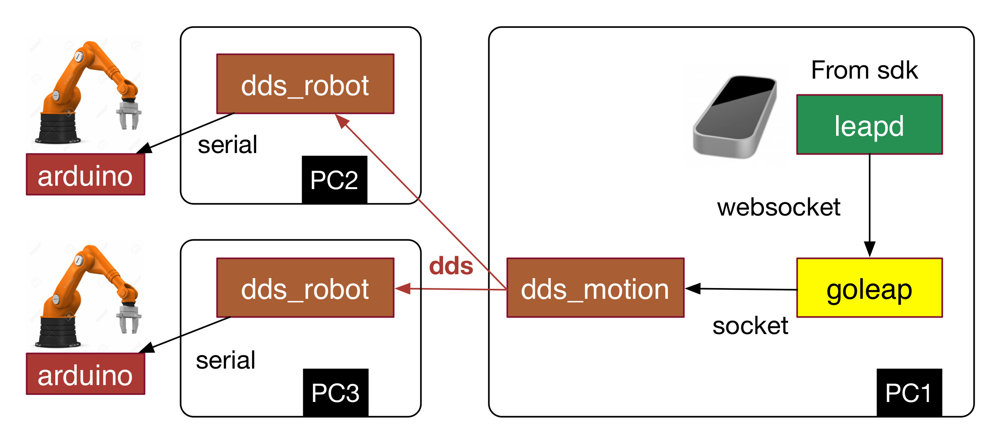

# dds-robot-arm

[](https://travis-ci.org/taka-wang/dds-robot-arm)

Control robotic arm with leap motion via DDS 



## Demo SOP

1. Power on two PCs
2. Plug-in usb cable and turn on AP Router
3. Check whether notebook connect to AP router automatically
4. Open terminal, split the console window
    1. run goleap
    2. run dds_motion
    3. ssh ad; run dds_robot
    4. ssh ad; run dds_robot2

## INSTALL LIBS

### System update

```bash    
sudo apt-get update
sudo apt-get install git libssl-dev libc-ares-dev build-essential libtool autoconf automake uuid-dev cmake
```

### Install DDS Library

Download [Vortex Lite](http://www.prismtech.com/vortex/software-downloads), then install it.


### Install libzmq(zeromq) 3.2.5

```bash
wget http://download.zeromq.org/zeromq-3.2.5.tar.gz
tar xvzf zeromq-3.2.5.tar.gz
cd zeromq-3.2.5
./configure
make
sudo make install
sudo ldconfig
#sudo ln -sf /usr/local/lib/libzmq.so /usr/lib/libzmq.so
```

### Install czmq (high-level C binding for zeromq)

```bash
git clone git://github.com/zeromq/czmq.git
cd czmq
./autogen.sh
./configure
make
sudo make install
sudo ldconfig
```

### Install librs232 (cross-platform serial library)

```bash
git clone https://github.com/taka-wang/librs232.git
cd librs232
./autogen.sh
./configure --prefix=/usr
make
sudo make install
sudo ldconfig
```

### Install golang 1.6 & zmq binding (for goleap)

```bash
sudo apt-get install pkg-config
curl -O https://storage.googleapis.com/golang/go1.6.linux-amd64.tar.gz
tar -xvf go1.6.linux-amd64.tar.gz
sudo mv go /usr/local
nano ~/.profile
export PATH=$PATH:/usr/local/go/bin

go get github.com/taka-wang/zmq3
go get github.com/taka-wang/gomotion
```

---

## BUILD

```bash
# build dds_motion, dds_robot, dds_robot2
cd dds-robot-arm
mkdir build
cd build
cmake ..
make

# build goleap
cd dds-robot-arm/goleap
go build

# build mqtt_motion, mqtt_robot
cd dds-robot-arm/mqtt
mkdir build
cd build
cmake ..
make
```
