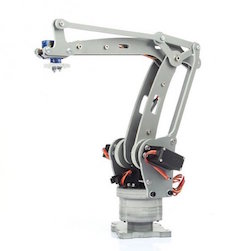

# Arduino Palletizing (4-Axis) Robot Arm

### Mechanism
[Robotic Arm](http://www.amazon.com/dp/B00NB1DFF2)

---

### PIN Setting

- pin09: Waist
- pin10: Large arm
- pin11: Small arm
- pin6:  Wrist

---

### Board
[Arduino Uno](https://www.arduino.cc/en/Main/ArduinoBoardUno) with [sensor shield](https://arduino-info.wikispaces.com/SensorShield)

---

### Servo Library
[VarSpeedServo](https://github.com/netlabtoolkit/VarSpeedServo)

---
